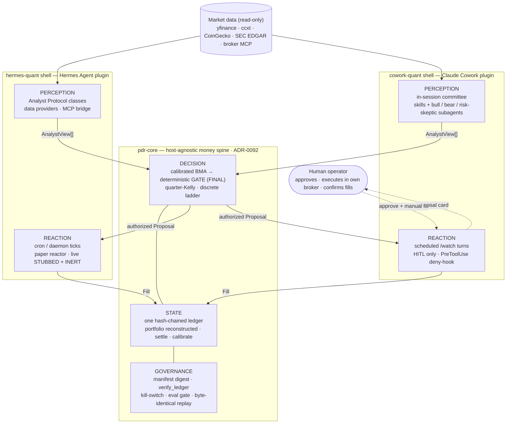
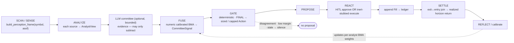
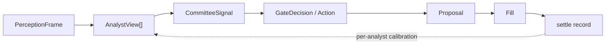
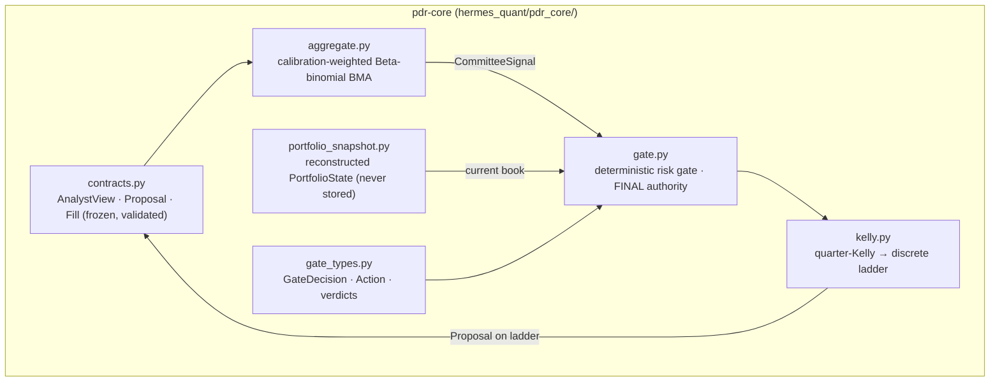
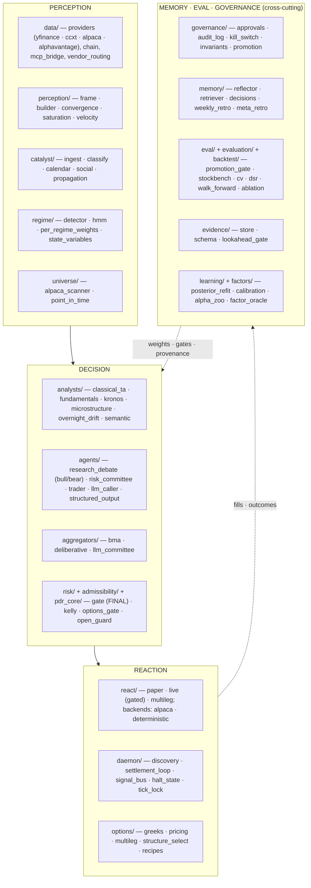
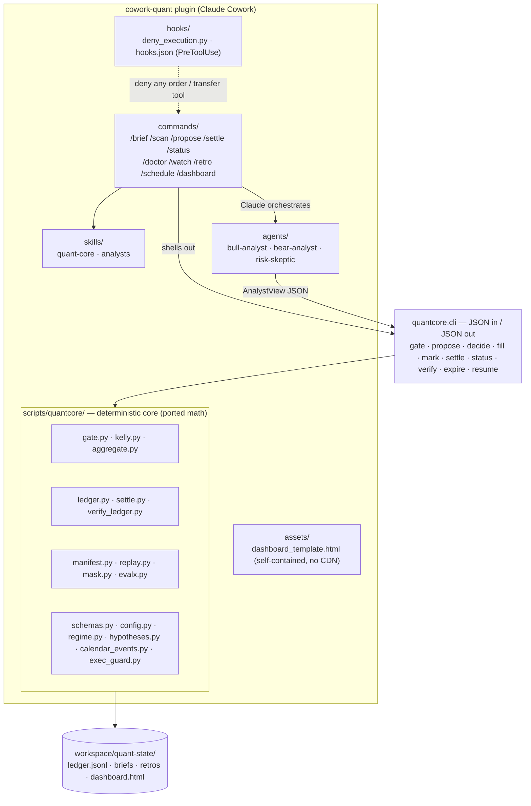
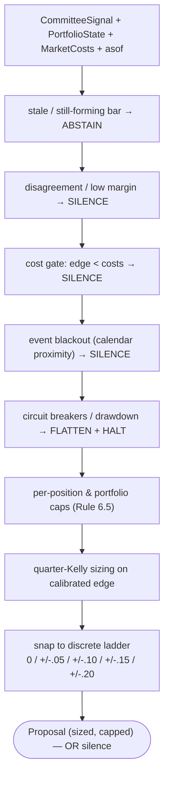
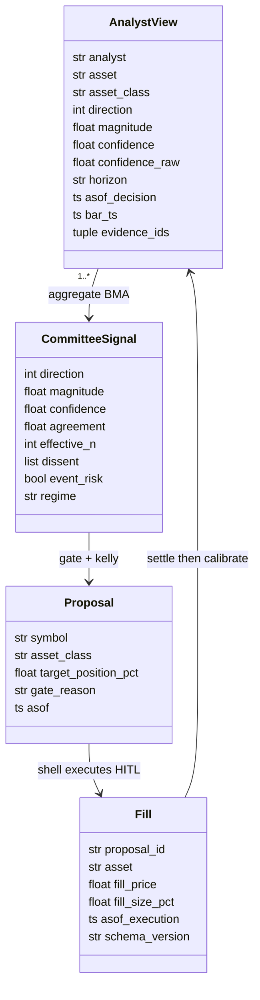
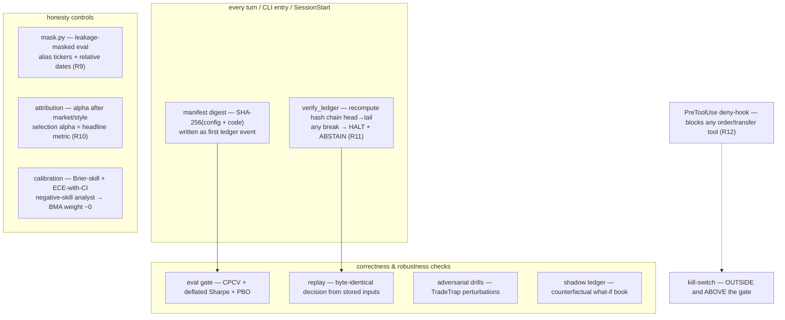

# hermes-quant / cowork-quant — hierarchical architecture diagrams

**Status:** living reference (regenerate when a layer changes)
**Date:** 2026-06-17
**Scope:** the whole system, drawn top-down from the system context to component
level. Covers the *current* shipped pieces (hermes-quant package; cowork-quant
v0.1) and the *target* shape they are converging on — the shared `pdr-core` +
two-shell design ratified by ADR-0092.

> **The one property to hold in mind:** authority is concentrated at one
> immutable choke point per concern. **Decision** authority = the deterministic
> risk gate (ADR-0004). **State** authority = one append-only hash-chained
> ledger (ADR-0085). **Learning** authority = a human sign-off (the advisory
> plane proposes, never ships, ADR-0080). The LLM runs strictly *upstream* as
> evidence that can only subtract; it is never an order authority. Paper /
> advisory only — silence by default.

Diagrams are Mermaid; they render on GitHub and in most markdown viewers. Read
them in order — each level zooms into the box above it.

---

## What the project is, in three sentences

`hermes-quant` is a mature multi-analyst Perception → Decision → Reaction (PDR)
trading framework distributed as a **Hermes Agent** plugin (~250 Python modules,
92 ADRs, paper/backtest/HITL only). `cowork-quant` is its lean sibling that
rebuilds the same charter for **Claude Cowork**: Claude runs the analyst
committee *in-session* and a small deterministic Python package
(`scripts/quantcore/`) owns everything money-adjacent. ADR-0092 is the
convergence target: extract the money-bearing math into one host-agnostic
**`pdr-core`** and let both hosts be thin shells over it.

---

## Level 0 — System context

The whole system: one shared core, two host shells, the human, and read-only
data. Both shells speak the same contract to the core (`AnalystView` in,
`Proposal` out, `Fill` back). The core cannot tell which host — or which kind of
analyst — produced a view, and that is the point.



The **structural substitution** between shells: hermes-quant's continuous
`daemon → signal bus → consumer` becomes cowork-quant's discrete
`scheduled turn → ledger queue → interactive session`. Because the charter is
already interday-only (ADR-0083), the discrete cadence costs almost nothing
theoretically — and it makes "no autonomous execution" a platform-enforced
invariant rather than a promise.

---

## Level 1 — The PDR paradigm and the canonical flow

Every firing path (live, autonomous, backtest) runs the same single pipeline.
Backtest only swaps a replay data provider; nothing else changes.



### The contract chain (the frozen boundary)

Decisions move through a chain of immutable typed objects — never prose, never a
shared mutable dict. On any validation failure the behavior is **ABSTAIN**, never
retry-into-compliance.



**Authority monotonicity** (the defining invariant): evidence can only *subtract*
upstream of the gate; the gate is the sole admit-and-size authority; nothing
downstream can re-introduce a silenced signal or size above the gate's envelope.

---

## Level 2 — Subsystem decomposition

### 2a. `pdr-core` — the money-bearing spine

The host-agnostic package (`hermes_quant/pdr_core/`, extraction in progress).
Pure stdlib + frozen dataclasses so it stays trivially movable to a standalone
repo; it imports no host or governance module.



### 2b. hermes-quant shell — subsystems mapped to PDR planes

The large package (~250 modules) organized by the plane each directory serves.
Everything money-adjacent (gate, kelly, ledger, settlement) is what ADR-0092
pulls down into `pdr-core`; the rest stays shell.



### 2c. cowork-quant shell — plugin anatomy

Claude orchestrates LLM subagents in-session; the deterministic `quantcore`
package does all money math behind a JSON CLI; hooks make no-execution a platform
rule; state lives in the user's workspace folder.



---

## Level 3 — Component level

### 3a. The deterministic gate (decision authority)

The gate is the single choke point. It consumes the fused signal, the
reconstructed book, costs, and `asof`, then walks an ordered rule stack — each
rule can only *silence, halt, or shrink*, never amplify. Sizing is the last step
and always snaps to the discrete ladder. (Exact rule order and thresholds live in
`gate.py` / ADR-0004; the stack below is representative.)



### 3b. The contract triad (frozen dataclasses)

The exact seam between shell and core (`pdr_core/contracts.py`). Construction
*rejects* off-ladder sizes, bool/str/NaN injections, and lookahead — the
anti-leverage-gambling and no-lookahead invariants are arithmetic, enforced at
the boundary. (`CommitteeSignal` fields are representative of the fused output.)



Key field semantics: `direction` is in {-1, 0, +1}; `confidence` is a *calibrated*
P(direction correct); `bar_ts <= asof_decision` is the no-lookahead anchor;
`target_position_pct` must sit on the ladder; `fill_size_pct` is the **absolute**
post-fill target (Option E, ADR-0091) — the fold derives the traded delta once.

### 3c. Governance & honesty plane (v0.2 controls)

State integrity and "honest numbers, not just honest machinery." Verification
runs on every load; honesty controls gate any number used in a config decision.



### 3d. cowork-quant command → CLI verb surface

How a user-facing slash command maps to the deterministic CLI. Commands are
prompt-orchestration; the CLI is the only thing that touches state.

| Command | quantcore CLI verb(s) | What it does |
|---|---|---|
| `/brief` | `status` | Daily PDR brief: regime, watchlist deltas, open book, event proximity |
| `/scan` | (committee only) | Run analysts on a ticker/watchlist → `AnalystView`s, no proposal |
| `/propose <ticker>` | `gate` → `propose` → `decide` | Full PDR turn: committee → gate → sized proposal → HITL approval |
| `/settle` | `mark`, `settle`, `fill` | Settle horizon-expired positions; record fills; update calibration |
| `/status` | `status`, `verify` | Show book, NAV, pending proposals, halts, calibration |
| `/watch` | `settle` → `mark` → `gate` → `propose` (+`expire`) | Unattended turn: queue gate-approved proposals only — **no approvals, no fills** |
| `/retro` | `settle` + reports | Weekly/quarterly retrospective; advisory-only config proposals |
| `/doctor` | `verify` | Environment + data-path + ledger-integrity health check |
| `/schedule` | — | Set up the autonomous cadence (Cowork scheduled tasks) |
| `/dashboard` | `status` | Render static (or live-artifact) HTML view of state |
| (human-only) | `resume` | Clear a circuit-breaker halt — requires explicit human confirmation |

### 3e. The rails (the bounds nothing in the loop may cross)

The eight v0.1 rails, plus four v0.2 additions promoted by the June-2026
literature. These are invariants, not preferences.

| # | Rail |
|---|---|
| 1 | Silence by default — disagreement or stale data → no proposal |
| 2 | Hard rules over LLM judgment — the gate's output is final |
| 3 | Discrete sizing ladder, enforced at config, gate, proposal *and* fill seams |
| 4 | No order execution, ever (cowork-quant; stricter than hermes-quant) |
| 5 | Asof-honesty — decision-time stamped; no still-forming bars |
| 6 | Structured output only — Pydantic/dataclass-validated before the ledger |
| 7 | Append-only hash-chained ledgers with integrity verification |
| 8 | New capabilities default-OFF until measured (risk-tightening may default ON) |
| R9 | Honesty over history — forward-only is the gold standard; replay is a masked diagnostic |
| R10 | Attribution before applause — credit *selection alpha*, not raw return |
| R11 | Verify state on every load — a hash-chain break halts and abstains |
| R12 | Platform-enforced no-execution — PreToolUse deny-hook, not just intent |

---

## Current state vs target (where the boxes really are today)

- **hermes-quant** — shipped and mature (v0.6.4 alpha): analysts, aggregators,
  deterministic gate, daemon/cron, paper reactors, governance, memory, eval,
  backtest, options, catalyst. Paper/HITL only; live execution stubbed + inert.
- **cowork-quant** — v0.1 shipped (168 tests): committee → gate → hash-chained
  ledger → HITL → dashboard. v0.2 is **designed, not yet coded** (Waves 4–7:
  ledger verifier, leakage-masked eval, manifest+replay, platform rails, then
  committee-v2 weighting, screener, attribution, then drills/evidence-store, then
  flag-gated options / foundation-model analyst / shadow ledger / quarterly retro).
- **pdr-core** — the convergence target (ADR-0092). `hermes_quant/pdr_core/`
  holds the frozen contract triad and gate/kelly/aggregate leaves; the migration
  that makes it the *sole* money spine for both shells is in progress.

So Levels 0–1 describe the **target** unified shape; Level 2b is **today's**
hermes-quant; Level 2c is **today's** cowork-quant v0.1 with the v0.2 components
(screener, mask, manifest, replay, shadow, attribution) drawn where they will sit.
```

