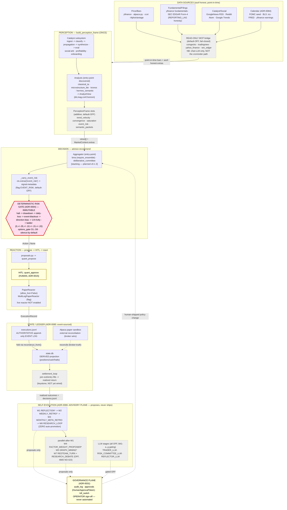

# hermes-quant — full pipeline architecture diagram

**Status:** living reference (regenerate when a layer changes)
**Date:** 2026-06-02
**Scope:** the end-to-end pipeline across all layers — data → perception → decision →
reaction → state/ledger → self-evolution — and the three immutable rails that bound it.

This is the consolidated, whole-system view. For the layer-specific design rationale see
[`pdr-unified-architecture.md`](pdr-unified-architecture.md) (ADR-0079, the forward
Perception→Decision→Reaction spine) and the ADRs cited in the legend below.

> **The one architectural property to hold in mind:** authority is concentrated at one
> immutable choke point per concern, in *both* directions —
> **decision** authority = the deterministic risk gate (ADR-0004);
> **learning** authority = human sign-off (ADR-0080, the advisory plane proposes, never ships);
> **state** authority = `executions.jsonl` as the append-only event log (ADR-0085).
> Every new capability is **default-OFF** and **byte-identical-when-off**; the gate, the
> discrete sizing ladder `{0,±0.05,±0.10,±0.15,±0.20}`, and the kill-switch are immutable by
> the loop. Paper-only; no MCP/LLM is ever an order authority.

```
╔══════════════════════════════════════════════════════════════════════════════════════════╗
║                        HERMES-QUANT  —  PDR PIPELINE (ADR-0079)                            ║
║         paper-only · silence-by-default · deterministic gate = sole order authority        ║
╚══════════════════════════════════════════════════════════════════════════════════════════╝

┌─────────────────────────────────────── DATA SOURCES ──────────────────────────────────────┐
│  PRICE/BARS            FUNDAMENTAL/FILINGS      CATALYST/SOCIAL          CALENDAR (ADR-0084) │
│  • yfinance (boot)     • yfinance fundamentals  • GoogleNews RSS         • FOMC seed.yaml(26)│
│  • alpaca-py (equity)  • SEC EDGAR (Form-4)     • Reddit Atom .rss        • BLS .ics (CPI/NFP)│
│  • ccxt (crypto)       • fundamentals_provider  • Google Trends RSS      • FRED releases(key)│
│  • AlphaVantage        (REPORTING_LAG honesty)  • social.py producers    • yfinance earnings │
│       │                      │                        │                        │            │
│  ┌────┴──────────┐    READ-ONLY MCP BRIDGE (mcp_bridge.py, default-OFF, fail-closed):       │
│  │ data/chain.py │      coingecko · tradingview · yahoo_finance · sec_edgar  (NO order tools)│
│  │ vendor_routing│      [alpaca MCP staged read-only+account, PAPER — operator-gated]       │
│  └────┬──────────┘    NB: MCP tools reach the CHAT LLM only — NOT the no_agent cron path    │
└───────┼──────────────────────────────────────────────────────────────────────────────────┘
        │ point-in-time bars + asof-honest extras (no lookahead; still-forming-bar dropped)
        ▼
┌────────────────────────── PERCEPTION  (build_perception_frame, ONCE) ─────────────────────┐
│  ANALYSTS (entry-point discovered)        PerceptionFrame slots (additive, default-OFF):   │
│   • classical_ta      ┐                    • trend_velocity   (PDR-2, flag)                 │
│   • microstructure_lite│  → AnalystView    • convergence       (PDR-3, flag)                 │
│   • kronos (GPU/CPU)   │   {dir,mag,conf,   • saturation        (PDR-4, flag)                 │
│   • hermes_semantic    ┘    horizon}        • event_risk        (calendar_market_extras,flag)│
│        ▲                                    • semantic_packets  (catalyst slice)            │
│        │ catalyst packets (velocity+convergence+info-parity)                                │
│   ┌────┴──────────── CATALYST SUBSYSTEM ────────────────┐                                   │
│   │ ingest→classify→propagation(graph)→synthesize→eval  │  onboarding (out-of-universe      │
│   │ social-arb · profitability loop · graph_mining(W5)  │  admission, flag + eval gate ba90)│
│   └──────────────────────────────────────────────────────┘                                 │
└───────┼───────────────────────────────────────────────────────────────────────────────────┘
        │ views[]  +  MarketContext{extras: event_risk, semantic_packets, ...}
        ▼
┌──────────────────────── DECISION  (advisor.recommend) ────────────────────────────────────┐
│  AGGREGATOR (entry-point):  bma (Bayesian Model Avg, require_ensemble)                      │
│                             deliberative_committee  ·  [stacking — planned v0.1.3]          │
│        │  AggregatedSignal{direction, magnitude, confidence, metadata}                      │
│        │  _carry_event_risk(signal, ctx)   ← copies ctx.extras['event_risk'] → metadata     │
│        ▼                                       (flag HERMES_QUANT_EVENT_RISK, default-OFF)   │
│   ╔══════════════════════════════════════════════════════════════════════════╗            │
│   ║  DETERMINISTIC RISK GATE (ADR-0004) — IMMUTABLE, SOLE AUTHORITY            ║            │
│   ║   rules: halt → drawdown → daily-loss → event-blackout(3.5) → direction-   ║            │
│   ║          bias → ¼-Kelly sizing → discrete ladder {0,±.05,±.10,±.15,±.20}   ║            │
│   ║   options: options_gate (O1..O8: greeks, BPR, assignment, earnings-IV)     ║            │
│   ║   silence-by-default: when uncertain → HOLD CASH (emit nothing)            ║            │
│   ╚══════════════════════════════╤═══════════════════════════════════════════╝            │
└──────────────────────────────────┼────────────────────────────────────────────────────────┘
                                    │ Action | None        (kill-switch sits OUTSIDE+ABOVE, immutable)
                                    ▼
┌──────────────────────── REACTION  (propose → HITL → react) ───────────────────────────────┐
│   proposals.py ──► quant_propose ──► HITL: quant_approve (human) ──► dispatch.py            │
│        │                                  ▲  (ADR-0015)                  │                  │
│        │ multi_leg (from_gate_result,     │                             ▼                  │
│        │  _GATE_MINTED lock — unforgeable) │              PaperReactor (allow_live=False)    │
│        └────────────────────────────────────┘            MultiLegPaperReactor (flag)         │
│                                                            live reactor (NOT enabled)        │
└──────────────────────────────────┬────────────────────────────────────────────────────────┘
                                    │ ExecutionRecord  (asof_decision, asof_execution, fill_size_pct…)
                                    ▼
┌──────────────────── STATE / LEDGER  (ADR-0085: event-sourced) ────────────────────────────┐
│   executions.jsonl  ──(authoritative append-only EVENT LOG)──┐                             │
│        │ fold via reconstruct_from()                          │  Alpaca paper sandbox       │
│        ▼                                                      │  (external reconciliation,  │
│   state.db  (DERIVED projection: positions/cash/halts)        │   broker-truth; broker wins)│
│        │  quant-ledger-reconcile.py rebuilds + heals drift ◄──┘                             │
│   settlement_loop (join exit↔entry fills → realized return; keystone, NOT yet wired)        │
└───────┼───────────────────────────────────────────────────────────────────────────────────┘
        │ realized outcomes + decision corpus (decisions.jsonl)
        ▼
┌════════════════ SELF-EVOLUTION  (ADR-0080, ADVISORY PLANE — proposes, never ships) ════════┐
│  W1 REFLECTION* ─► W2 WEEKLY_RETRO* ─► W3 MONTHLY_META_RETRO ─► W6 RESEARCH_LOOP            │
│   (reflector)       (beliefs.jsonl)      (meta_retro)            (hypothesis→factor→         │
│      │  parallel-after-W1:                                       promotion, ZERO auto-promo) │
│      ├─ W4 FACTOR_WEIGHT_PROPOSER*  (candidate BMA weights, OOS-gated)                       │
│      ├─ W5 GRAPH_MINING            (catalyst edge candidates)                                │
│      └─ W7 REDTEAM_TURN  +  RESEARCH_DEBATE   ← OFF (4665 NO-GO: gates 2+3 absent)           │
│   LLM stages: TRADER_LLM · RISK_COMMITTEE_LLM · REFLECTOR_LLM  (all OFF, B41-a..g gating)    │
│                                                                                             │
│   * = ENABLED in .env (2026-06-01).  ALL outputs → promotion_gate → OPERATOR sign-off ──────┼─┐
└═════════════════════════════════════════════════════════════════════════════════════════════┘ │
   GOVERNANCE PLANE (ADR-0031): audit_log · approvals(HumanApprovalToken) · kill_switch ◄────────┘
   the ONLY path from "evolved idea" → "live policy" runs through deterministic OOS backtest +
   promotion gate + human sign-off (never automated).

  ──► forward decision flow    ◄── learning/reconciliation flow    ║box║ = immutable rail
```

## Legend & layer key

| Layer | What it does | Key modules | ADR / flag |
|---|---|---|---|
| **Data sources** | Point-in-time, asof-honest market/fundamental/catalyst/calendar inputs | `data/chain.py`, `data/vendor_routing.py`, `data/fundamentals_provider.py`, `data/mcp_bridge.py` | ADR-0005; ADR-0084 (calendar) |
| **MCP read bridge** | Surfaces the 4 keyless read-only MCP data servers to the chat LLM only (never the cron/order path); fail-closed, default-OFF | `data/mcp_bridge.py` (`READ_ONLY_SERVERS`) | MCP-INTEGRATION.md |
| **Perception** | Builds ONE `PerceptionFrame` per symbol; analysts emit `AnalystView`; catalyst packets + PDR slots | `perception/`, `analysts/`, `catalyst/` | ADR-0079 PDR-1..4 |
| **Decision** | Aggregates views → `AggregatedSignal`; carries event_risk; the deterministic gate sizes/admits | `advisor.py`, `aggregators/bma.py`, `risk/gate.py`, `risk/options_gate.py` | ADR-0003, **ADR-0004** |
| **Reaction** | propose → human approve (HITL) → react; paper-only reactor | `proposals.py`, `react/paper.py`, `react/dispatch.py`, `options/multileg.py` | **ADR-0015** |
| **State / ledger** | `executions.jsonl` is authoritative; `state.db` is a derived projection; Alpaca sandbox = external reconciliation | `state/portfolio_state.py`, `ops/scripts/quant-ledger-reconcile.py`, `daemon/settlement_loop.py` | **ADR-0085** |
| **Self-evolution** | W1–W7 advisory-plane loops; produce proposals only; human ships every change | `memory/`, `research/`, `factors/`, `governance/promotion.py` | **ADR-0080**, ADR-0081 |
| **Governance** | Audit log, human-approval tokens, the two kill-switches | `governance/audit_log.py`, `governance/approvals.py`, `governance/kill_switch.py` | ADR-0031 |

### The three immutable rails (`║box║` in the diagram)
1. **Deterministic risk gate** (ADR-0004) — between aggregator and reactor; sole order authority; discrete sizing ladder; never amplifies, only rejects/sizes-down.
2. **HITL** (ADR-0015) — orders flow `propose → human-approve → gate → react`; no MCP/LLM places orders.
3. **Kill-switch** — sits outside and above the gate; see [`../operations/KILL-SWITCH-RECOVERY.md`](../operations/KILL-SWITCH-RECOVERY.md) (governance + autonomous variants).

### Flag legend (default-OFF unless noted)
- **PDR / perception:** `HERMES_QUANT_{TREND_VELOCITY, CONVERGENCE, SATURATION, EVENT_RISK, CALENDAR_ENABLED, SEMANTIC_ENABLED*}`
- **Self-evolution (W-waves):** `HERMES_QUANT_{REFLECTION*, MEMORY_INJECT*, WEEKLY_RETRO*, FACTOR_WEIGHT_PROPOSER*, GRAPH_MINING*, MONTHLY_META_RETRO**, RESEARCH_LOOP**, REDTEAM_TURN}`
- **LLM stages (all OFF, gated on B41-a..g):** `HERMES_QUANT_{TRADER_LLM, RISK_COMMITTEE_LLM, REFLECTOR_LLM, RESEARCH_DEBATE}`
- `*` = enabled in deployed `.env` (2026-06-01); `**` = armed (cron inert until upstream produces input).
- The authoritative generated flag table: [`../operations/FLAG-INVENTORY.md`](../operations/FLAG-INVENTORY.md).

## Mermaid version (renders on GitHub / VS Code / mkdocs)

The same pipeline as a Mermaid flowchart. Labels are quoted and use `<br>` for line breaks
and ASCII-safe text (`+/-`, `->`) so the parser does not choke on `(`, `{`, or unicode.
Immutable rails are styled red; default-OFF / advisory nodes dashed.



## Known gaps (as of 2026-06-02)
- **settlement_loop keystone is built but NOT wired** — realized-return joining has no production caller, so the learning loop's measurement input is dark (seed `335e`).
- **LLM stages have no cost ceiling / OOS-beats-fallback gate** — the `B41-a..g` family is the gating work before any LLM flag can flip (4665 NO-GO verdict).
- **Alpaca broker-vs-projection reconcile not built** — positions filled directly at the broker (not via local decisions) aren't in `executions.jsonl`; ADR-0085's reconcile-vs-broker step is future work.

## Regenerating this diagram
This is a hand-maintained reference, not generated. When a layer changes (a new analyst,
a gate rule, a ledger-authority change), update the diagram + the layer key together, and
bump the date. Cross-check the flag legend against `ops/scripts/quant-flag-inventory.py --write`.
